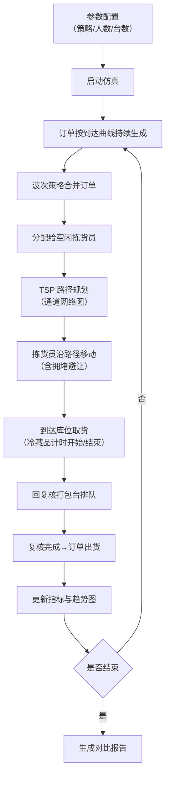

## 1. 产品概述

生鲜电商前置仓分拣策略仿真与对比平台。通过可视化仿真不同波次合并策略与拣货路径规划算法，量化评估出货速度、拣货距离、冷藏品暴露时长等核心指标，辅助仓储运营决策。

- 目标用户：仓储运营经理、算法工程师、供应链分析师
- 核心价值：在无需真实仓库改造的前提下，低成本、可重复地对比多种分拣策略优劣

## 2. 核心功能

### 2.1 功能模块

1. **仿真主控台**：时间控制（播放/暂停/单步/加速）、策略切换、参数调节（拣货员数、复核台数、订单到达强度）
2. **仓库可视化**：Canvas 俯视图渲染通道货架、出入口、复核台、暂存区；实时显示拣货员位置与路径、通道拥堵热力、打包台排队
3. **仿真内核**：订单到达曲线生成、商品库位映射、冷藏/常温分区、三种波次策略、通道网络 TSP 路径规划、多拣货员拥堵避让、复核台排队
4. **实时指标面板**：平均订单履行时长、总行走距离、通道拥堵度、打包台利用率、单位时间出货量、冷藏品平均暴露时长
5. **实时趋势图**：滚动折线显示单位时间出货速度与在拣订单数
6. **多策略对比报告**：并行跑多种波次策略，关键指标列表对照 + 差异高亮

### 2.2 页面详情

| 页面名称 | 模块名称 | 功能描述 |
|----------|----------|----------|
| 主仿真页 | 控制栏 | 策略选择（下拉）、拣货员/复核台数量（滑块）、时间倍速（按钮）、播放/暂停/单步、重置 |
| 主仿真页 | 仓库 Canvas | 俯视图：通道/货架/出入口/复核台/暂存区；拣货员移动动画、库位停留高亮、通道拥堵热力叠加、打包台排队人数 |
| 主仿真页 | 指标卡片组 | 6 张核心 KPI 卡片，实时数值 + 简短趋势箭头 |
| 主仿真页 | 滚动折线图 | 双轴折线：单位时间出货量（左轴）、在拣订单数（右轴），时间窗口 60s 滚动 |
| 对比报告页 | 策略参数配置 | 选择对比的策略集合、仿真时长、重复次数 |
| 对比报告页 | 指标对照表 | 策略×指标矩阵，数值 + 相对最优百分比，最优值高亮 |
| 对比报告页 | 进度显示 | 各策略并行仿真进度条 |

## 3. 核心流程

## 4. 用户界面设计

### 4.1 设计风格

- **主色调**：深空蓝灰底（`#0f172a`）+ 冷绿强调（`#22d3ee` 表示正常）+ 琥珀警示（`#f59e0b` 表示拥堵）+ 品红告警（`#ec4899` 表示冷藏超时）
- **辅色**：货架灰（`#334155`）、通道深灰（`#1e293b`）、常温库位青（`#06b6d4`）、冷藏库位蓝（`#3b82f6`）
- **字体**：JetBrains Mono（数字/指标）+ Inter（正文/标签）—— 营造工业仪表盘与代码编辑器的精密感
- **按钮风格**：方角矩形、1px 细描边、hover 时发光描边 + 背景微亮、按下凹陷
- **布局风格**：三栏仪表盘式。左：指标卡 + 折线图；中：全屏 Canvas 主视图；右：控制栏 + 参数滑块
- **视觉风格关键词**：工业科技、数据密集、精密冷静、微光霓虹

### 4.2 页面设计概览

| 页面名称 | 模块名称 | UI 要素 |
|----------|----------|---------|
| 主仿真页 | 控制栏 | 深色栏、细分割线、单色图标（lucide）、选中策略发光描边、倍速按钮组（1×/2×/4×/8×） |
| 主仿真页 | Canvas 主视图 | 1px 格网背景、货架矩形+库位编号、拣货员带拖尾圆点、路径用虚线、拥堵热力用红色半透明渐变叠加 |
| 主仿真页 | 指标卡片 | 64×64px 数字、等宽字体、下方小字标签、右侧迷你 sparkline、趋势箭头（↑红↓绿） |
| 主仿真页 | 折线图 | 双 y 轴、面积填充、滚动时间窗、网格虚线、图例在顶部 |
| 对比报告页 | 指标对照表 | 斑马行、最优值加粗+绿底微亮、相对值用 badge、列可排序 |

### 4.3 响应式

桌面优先（1440px+），Canvas 自适应容器宽度。控制栏与指标卡可折叠为抽屉，适配 1024px 平板。

### 4.4 动效

- 拣货员移动：位置插值 + 拖尾渐隐（5 帧）
- 拥堵热力：颜色渐变过渡（1s）
- 指标更新：数字滚动动画（300ms ease-out）
- 页面切换：淡入（200ms）
