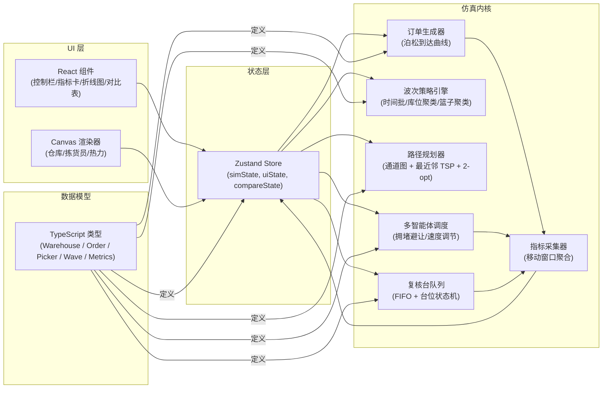
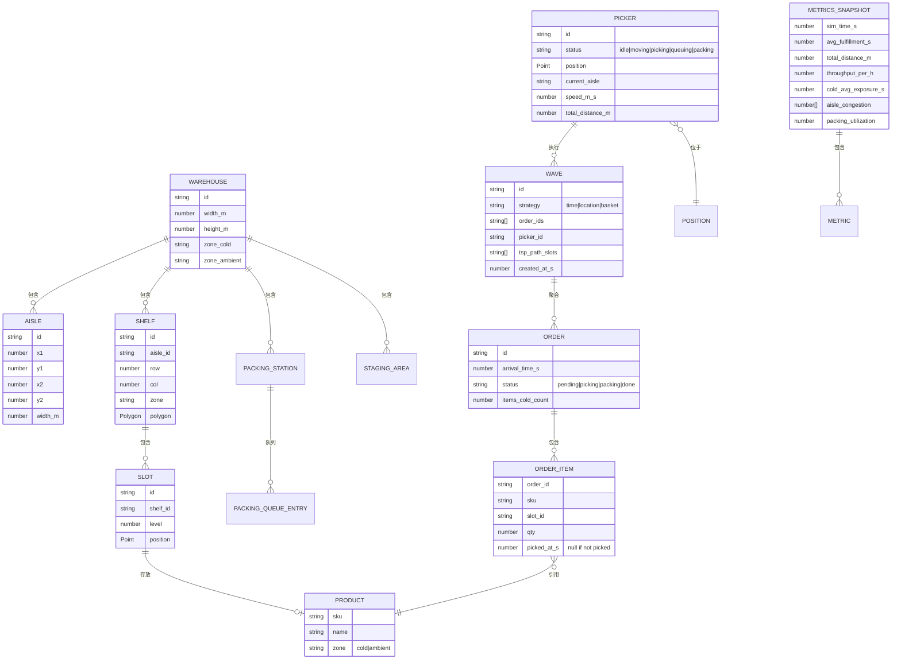

## 1. 架构设计



## 2. 技术选型

- **前端框架**：React@18 + TypeScript@5
- **构建工具**：Vite@5
- **样式**：Tailwind CSS@3
- **状态管理**：Zustand@4
- **图表**：轻量自绘 Canvas（避免 echarts 体积），折线图自绘
- **图标**：lucide-react
- **后端**：无，纯前端仿真

## 3. 路由定义

| 路由 | 页面 | 用途 |
|------|------|------|
| / | SimulationPage | 主仿真页面：Canvas + 指标 + 控制 |
| /compare | ComparePage | 多策略并行对比报告 |

## 4. 数据模型



## 5. 核心算法

### 5.1 订单生成
- 到达间隔：泊松过程 `exp(λ)`，λ 为每小时订单数（可调，默认 120 单/小时）
- 商品 SKU：从预置 SKU 池按热度采样（Zipf 分布）
- 订单结构：2–8 件商品，冷/温比例可调（默认 30% 冷藏）

### 5.2 波次策略
1. **时间分批 (time)**：每 ΔT 秒（可调，默认 120s）将所有待拣订单打包成一波，单波上限 N（默认 8 单）
2. **库位聚类 (location)**：以待拣订单的所有目标库位坐标为特征，做 K-Means（K=拣货员数）聚成波次，每波订单数均衡
3. **篮子聚类 (basket)**：以订单 SKU 集合为特征做 Jaccard 相似度聚类，相似度高的订单合并，减少重复库位访问

### 5.3 路径规划 (TSP)
- 仓库通道建模为无向图 `G=(V,E)`，V 为通道交叉点，E 带权重为通道段长度
- 库位→最近通道顶点映射
- 起点为当前位置，终点为最近复核台
- 所有目标库位 + 起终点间用 A* 预计算两两最短路径
- 最近邻启发式生成初始 TSP 回路，再用 2-opt 局部搜索优化（迭代至无改进）

### 5.4 拥堵避让
- 每个通道段维护当前拣货员数量 `n`
- 基础速度 `v0 = 1.5 m/s`
- 实际速度 `v = v0 / (1 + α·n)`，α 为拥堵系数（默认 0.3）
- 两人同段相对而行时，一方降速至 0.5× 持续 2s

### 5.5 复核台排队
- 每台处理速率 μ（可调，默认 30s/单）
- 多台共享全局队列或每台独立队列（可配置）
- 利用率 = 忙时 / 总时

## 6. 仿真循环

固定步长 Δt = 100ms（仿真时间，非墙钟）。每步：
1. 订单生成器按 λ 产生新订单
2. 波次策略判定是否生成新波
3. 空闲拣货员分配波次并跑 TSP
4. 每个拣货员按路径移动，计算本步位移与拥堵减速
5. 到达库位触发取货事件，记录冷藏暴露
6. 到达复核台排入队列
7. 复核台按速率出队
8. 指标采集器写入滚动窗口
9. React 状态更新 → UI 重绘

## 7. 目录结构

```
src/
├── components/
│   ├── ControlBar.tsx          # 控制栏（策略/人数/倍速/播放）
│   ├── MetricCards.tsx         # 6 张 KPI 卡
│   ├── TrendChart.tsx          # 滚动双轴折线图
│   ├── WarehouseCanvas.tsx     # 主 Canvas 渲染
│   ├── CompareTable.tsx        # 对比报告表
│   └── Slider.tsx              # 通用参数滑块
├── simulation/
│   ├── types.ts                # 全部 TS 类型
│   ├── warehouse.ts            # 仓库布局生成器
│   ├── orderGen.ts             # 订单生成
│   ├── waveStrategies/
│   │   ├── timeBatch.ts
│   │   ├── locationCluster.ts
│   │   └── basketCluster.ts
│   ├── pathPlanner.ts          # A* + TSP
│   ├── agents.ts               # 拣货员调度 + 拥堵
│   ├── packing.ts              # 复核台队列
│   ├── metrics.ts              # 指标聚合
│   └── engine.ts               # 仿真主循环封装
├── pages/
│   ├── SimulationPage.tsx
│   └── ComparePage.tsx
├── store/
│   └── useSimStore.ts          # Zustand
├── utils/
│   ├── canvas.ts
│   ├── math.ts
│   └── color.ts
├── App.tsx
├── main.tsx
└── index.css
```
